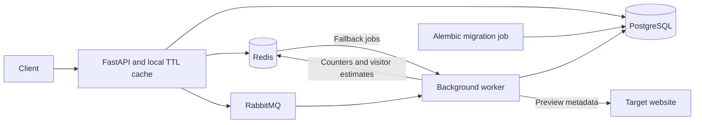

# URL Shortener

A backend portfolio project built with **Python 3.12, FastAPI, PostgreSQL, Redis, and RabbitMQ**. It supports anonymous and authenticated link creation, cached redirects, and background click analytics and preview enrichment.

PostgreSQL owns persistent data; Redis accelerates reads and rate limiting; RabbitMQ separates worker processing from HTTP responses. The project demonstrates these engineering choices in a local Docker Compose stack. It has no published throughput benchmarks or production availability claims.

Start with [Local Development](#local-development) for Docker setup or [Testing](#testing) for the Python checks.

## Architecture



The API and worker start after healthy dependencies and a successful migration job. `/healthz` checks PostgreSQL and Redis; it does not report RabbitMQ or worker health.

## Core Features

- Random short codes, custom aliases, optional expiration, and HTTP 307 redirects.
- Database-enforced short-code uniqueness with retry on generated-code collisions; reserved aliases are rejected.
- Anonymous links managed with a returned `X-Manage-Token`; authenticated links also appear in their owner's dashboard endpoints.
- Registration, login, JWT access tokens, rotating refresh tokens in HttpOnly cookies, and logout.
- Process-local and Redis redirect caches, short-lived negative caching, and Redis rate limiting.
- Background click events, daily aggregates, approximate unique visitors, preview metadata, and QR SVG generation.

## Technology Stack

| Layer | Implementation |
| --- | --- |
| HTTP API | FastAPI, Pydantic, Uvicorn |
| Persistence | PostgreSQL 16, SQLAlchemy 2 async sessions, asyncpg |
| Migrations | Alembic with psycopg |
| Cache / rate limits | Redis 7 |
| Background processing | RabbitMQ 3.13, aio-pika, asyncio workers |
| Enrichment | HTTPX, Beautiful Soup, qrcode |
| Local runtime / checks | Docker Compose, pytest, Ruff, GitHub Actions |

Direct dependencies are pinned in `requirements.txt` and `requirements-dev.txt`; `requirements-constraints.txt` also pins the resolved transitive dependencies for repeatable installs.

## Request / Redirect Flow

1. `POST /api/v1/links` validates the URL, alias, and expiration, inserts a link, and warms Redis. An optional bearer token attaches ownership. The response includes a management token; retain it to read link details, previews, QR codes, and analytics.
2. `GET /{short_code}` checks the local TTL cache, Redis, then PostgreSQL. Missing links return 404; expired links return 410. Successful resolution returns a 307 with the original destination.
3. FastAPI background tasks enqueue `link.enrich` after creation and `click.track` after redirects. Workers fetch metadata/generate QR SVGs or persist click events and update daily statistics.
4. Failed RabbitMQ publication falls back to Redis lists. Workers consume those lists too, with bounded retries and a Redis dead-letter list. This is a best-effort fallback, not a guarantee of lossless delivery.

Interactive API documentation is available at `/docs` in development; `/` serves the bundled API reference page. Auth routes live under `/api/v1/auth`, owned links at `/api/v1/users/me/urls`, and owner-only statistics at `/api/v1/urls/{url_id}/stats`.

## Storage Strategy

- `links` stores the destination, unique public UUID and short code, nullable owner, expiration, management-token hash, click total, preview metadata, and QR SVG. PostgreSQL migrations use JSONB for previews.
- `users` and `refresh_tokens` store account and refresh-token lifecycle data. Passwords use scrypt hashing.
- `click_events` records individual clicks with a unique request UUID to deduplicate database ingestion. Client IPs are HMAC-hashed before queuing.
- `link_daily_stats` has one row per link/date and is updated with a PostgreSQL upsert. Analytics reads use these aggregates plus a limited recent-event query.
- Redis holds redirect payloads and misses, rate-limit counters, sharded click counters, and HyperLogLog visitor estimates. Local caches are per API process; expiration is checked before returning a cached destination.

## Local Development

Install Docker with the Compose v2 plugin. From the repository root:

```sh
cp .env.example .env
```

PowerShell: `Copy-Item .env.example .env`. Replace `SECRET_KEY`, `POSTGRES_PASSWORD`, and `RABBITMQ_PASSWORD` with separate random values. With Python available, run `python -c "import secrets; print(secrets.token_hex(32))"` for each value. Keep `.env` private; it is ignored by Git and excluded from the Docker build context.

```sh
docker compose config --quiet
docker compose up --build -d
docker compose ps
```

- API/reference: <http://localhost:8000>
- Swagger UI: <http://localhost:8000/docs>
- RabbitMQ management: <http://localhost:15672> (use the credentials in `.env`)

Published ports bind to loopback. PostgreSQL, Redis, and the AMQP port are accessible only within the Compose network. Keep `DATABASE_HOST=db`, `REDIS_HOST=redis`, and `RABBITMQ_HOST=rabbitmq` for this setup.

Create a link in Swagger UI or, in a POSIX shell:

```sh
curl -X POST http://localhost:8000/api/v1/links \
  -H 'Content-Type: application/json' \
  -d '{"url":"https://example.com/","custom_alias":"demo-link"}'
curl -i http://localhost:8000/demo-link
```

PowerShell users can use `Invoke-RestMethod -Method Post -Uri http://localhost:8000/api/v1/links -ContentType application/json -Body '{"url":"https://example.com/","custom_alias":"demo-link"}'`.

The existing API service name is `url-shotener-api` (spelling retained). Use `docker compose logs url-shotener-api worker migrate` for diagnostics. After code edits, rerun `docker compose up --build -d`. `docker compose down` stops the stack and retains named data volumes; existing volumes retain their original database/broker credentials.

## Database Migrations

Compose runs `alembic upgrade head` in the one-shot `migrate` service before the API and worker start. Migration history covers the initial link/analytics schema followed by authentication and ownership.

```sh
docker compose run --rm migrate alembic heads
docker compose run --rm migrate alembic history
docker compose run --rm migrate alembic current
docker compose run --rm migrate
```

The last command applies pending migrations. Connection settings come from the environment through `app/core/config.py`; `alembic.ini` contains no credentials. Migration files live in `alembic/versions/`.

## Testing

Use Python 3.12. From the repository root:

```sh
python -m venv .venv
. .venv/bin/activate
python -m pip install -r requirements-dev.txt
python -m ruff check .
python -m pytest
python -m alembic heads
python -m alembic upgrade head --sql
```

On PowerShell, activate with `.venv\Scripts\Activate.ps1`, or invoke `.venv\Scripts\python.exe` directly in place of `python`.

Tests exercise real API routes and SQLAlchemy service logic against an isolated in-memory SQLite database. The existing Redis test double replaces the external cache and RabbitMQ is deliberately unavailable, exercising fallback job publication. No running infrastructure or `.env` is required for the default development settings.

Coverage includes authentication/refresh rotation, ownership restrictions, creation and management, collision retries, duplicate/invalid aliases, redirects through all cache layers, negative-cache invalidation, expiration, and connection-URL credential encoding. These tests do **not** validate PostgreSQL-specific analytics upserts, real Redis HyperLogLog behavior, or broker delivery/recovery. GitHub Actions runs the full suite, Ruff, Compose validation, and offline migration SQL generation. MyPy and repository-wide formatting enforcement are not configured.

## Scaling Considerations

There are no measured capacity or load-test results in this repository. Potential next steps should follow profiling: batch analytics writes, partition/retain raw events, monitor cache hit rates and queue lag, budget PostgreSQL connections across API processes, and evaluate independent API/worker replication behind a load balancer.

The supplied stack runs single instances of PostgreSQL, Redis, and RabbitMQ; it is not highly available. More replicas require an explicit cache invalidation strategy and operational work on failover, backups, observability, and recovery testing.

## Project Status

A supporting backend/database engineering portfolio project with a runnable local stack and focused automated tests. The bundled UI is an API reference; a separate frontend and link update/delete endpoints are not implemented.

Known operational limits: background tasks have no transactional outbox, RabbitMQ publisher confirms are disabled, and Redis fallback lists remove a job before processing, so crashes can lose work. Redis click counters can overcount retries even though PostgreSQL event insertion is deduplicated. Raw events have no automated retention, and visitor estimates depend on Redis state. Device breakdowns are currently empty placeholders.

Metadata fetching checks public IPs and redirects and limits time/body size, but DNS resolution is checked separately from the HTTP connection; deployment needs outbound network controls against DNS rebinding. Before exposing a hosted instance, configure production secrets, HTTPS, secure cookies/CORS, trusted proxies, and abuse controls. Public source availability does not imply production deployment readiness.
